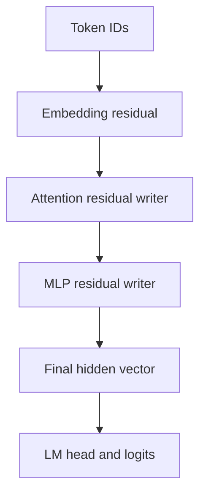
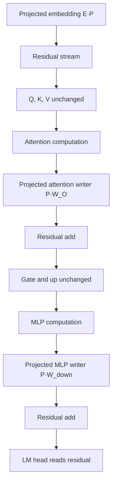
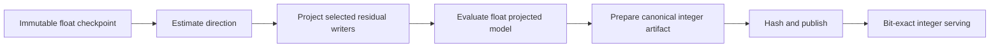

# Abliteration Principles: Direction Removal and Idempotent Weight Updates

> Written and explained by **Rishabh Gupta**  
> Google Developer Expert — Machine Learning, Google Cloud Platform, and JAX

This document explains the mathematics behind abliteration using simple two-dimensional integer examples. It focuses on how a behavioral direction is estimated, how hidden activations or residual-writer weights are changed, which Transformer layers are normally modified, and how to make a permanent projection update mathematically and operationally idempotent.

This is an interpretability and model-behavior analysis technique. Removing refusal-related representations can weaken safety behavior and does not make generated information correct, reliable, or safe.

---

## 1. Ablation versus abliteration

**Ablation** is the general experimental idea of removing a component and measuring what changes.

Examples include:

- setting one neuron to zero;
- disabling an attention head;
- removing a layer;
- deleting one feature direction from a hidden vector;
- projecting a weight matrix away from a chosen subspace.

**Abliteration** is a specific directional ablation procedure commonly associated with refusal behavior in instruction-tuned LLMs.

The main hypothesis is:

```text
some part of refusal behavior is represented by a direction
inside the model's residual stream
```

The procedure estimates that direction and prevents the model from representing or writing it.

---

## 2. What tensor is changed

The prompt's token IDs are normally not modified.

```text
token IDs: [41, 983, 17]
```

After embedding and Transformer computation, each token has a hidden vector:

```text
X shape = [batch, sequence, hidden_dimension]
```

For one token in a tiny model:

```text
x = [6, 2]     shape = [2]
```

Abliteration changes `x`, or changes a matrix that writes a vector like `x` into the residual stream.



The directional intervention is usually placed on the residual stream or on the components that write into it.

---

## 3. Discovering a behavioral direction

Collect two matched prompt groups:

- `B`: prompts that trigger the target behavior;
- `G`: control prompts that do not trigger it.

At a chosen layer and token position, record hidden vectors.

For a simple two-dimensional example:

```text
B = [6, 4]
    [4, 2]

G = [2, 2]
    [2, 0]
```

Calculate the group means:

```text
mean(B) = [(6+4)/2, (4+2)/2] = [5, 3]
mean(G) = [(2+2)/2, (2+0)/2] = [2, 1]
```

The difference-of-means direction is:

```text
r = mean(B) - mean(G)
  = [5, 3] - [2, 1]
  = [3, 2]
```

In a real model:

```text
B shape = [number_of_behavior_prompts, hidden_dimension]
G shape = [number_of_control_prompts, hidden_dimension]
r shape = [hidden_dimension]
```

Normalize the direction when using the unit-vector projection formula:

```text
r_hat = r / ||r||_2
```

For `r = [3, 2]`:

```text
||r||_2 = sqrt(3^2 + 2^2) = sqrt(13)
r_hat   = [3/sqrt(13), 2/sqrt(13)]
```

The sign is irrelevant for removal because `r_hat r_hat^T` is the same for `r_hat` and `-r_hat`.

---

## 4. Projection without requiring a unit vector

For hand calculations, it is often easier to use the unnormalized formula:

```text
projection of x onto r = r * (r^T x) / (r^T r)
```

Remove it:

```text
x_new = x - r * (r^T x) / (r^T r)
```

This is equivalent to the unit-vector form:

```text
x_new = x - (x^T r_hat) r_hat
```

---

## 5. A fully integer 2D activation example

Choose a simple behavioral direction:

```text
r = [1, 1]
```

Choose an activation whose coordinate sum is even:

```text
x = [6, 2]
```

### Step 1: calculate alignment

```text
r^T x = 1*6 + 1*2 = 8
```

### Step 2: calculate direction length squared

```text
r^T r = 1*1 + 1*1 = 2
```

### Step 3: calculate the parallel component

```text
projection = r * 8/2
           = [1, 1] * 4
           = [4, 4]
```

### Step 4: subtract it

```text
x_new = [6, 2] - [4, 4]
      = [2, -2]
```

### Step 5: verify removal

```text
r^T x_new = 1*2 + 1*(-2) = 0
```

The vector was not erased. Only its component parallel to `[1, 1]` was removed.

```text
before: [6,  2]
remove: [4,  4]
after:  [2, -2]
```

---

## 6. The projection matrix

Define:

```text
P = I - r r^T / (r^T r)
```

For `r = [1, 1]`:

```text
r r^T = [1] [1 1] = [1 1]
        [1]         [1 1]

r^T r = 2
```

Therefore:

```text
P = [1 0] - 1/2 [1 1]
    [0 1]       [1 1]

  = [ 1/2  -1/2]
    [-1/2   1/2]
```

Apply it:

```text
P x = [ 1/2  -1/2] [6] = [ 3 - 1] = [ 2]
      [-1/2   1/2] [2]   [-3 + 1]   [-2]
```

---

## 7. Why the update is mathematically idempotent

An orthogonal projection matrix satisfies:

```text
P^2 = P
```

Therefore:

```text
P(Px) = Px
```

Using the previous result:

```text
P [ 2] = [ 2]
  [-2]   [-2]
```

Applying the same exact projection twice does not continue changing the vector.

This is genuine mathematical idempotency—not merely deterministic repetition.

### Proof

Let:

```text
A = r r^T / (r^T r)
P = I - A
```

Because `A` projects onto the one-dimensional span of `r`:

```text
A^2 = A
```

Then:

```text
P^2 = (I-A)(I-A)
    = I - 2A + A^2
    = I - 2A + A
    = I - A
    = P
```

---

## 8. Inference-time activation ablation

At runtime, replace an activation `x` with:

```text
x_new = P x
```

or:

```text
x_new = x - (x^T r_hat) r_hat
```

For a tensor:

```text
X shape = [batch, tokens, hidden_dimension]
r shape = [hidden_dimension]
```

the same direction is removed independently from each selected token and layer.

```python
import torch

def remove_direction(
    activations: torch.Tensor,  # [..., d_model]
    direction: torch.Tensor,    # [d_model]
) -> torch.Tensor:
    direction = direction / direction.norm()

    # [..., d_model] dot [d_model] -> [...]
    coefficient = torch.einsum(
        "...d,d->...",
        activations,
        direction,
    )

    # [...] -> [..., 1], then broadcast over d_model
    parallel_component = coefficient.unsqueeze(-1) * direction

    return activations - parallel_component


x = torch.tensor([6.0, 2.0])
r = torch.tensor([1.0, 1.0])

print(remove_direction(x, r))
# tensor([ 2., -2.])
```

Advantages:

- reversible;
- original checkpoint remains unchanged;
- useful for comparing candidate layers and directions;
- intervention strength can be adjusted.

Disadvantages:

- adds runtime operations and memory traffic;
- hooks can complicate optimized inference;
- applying it everywhere may cause more collateral damage;
- it must be consistently applied during both prefill and decode.

---

## 9. Partial ablation

Introduce a strength `alpha`:

```text
x_new = x - alpha * projection_r(x)
```

| `alpha` | Meaning |
|---:|---|
| `0` | No intervention |
| `0.5` | Remove half of the selected component |
| `1` | Complete orthogonal projection |
| Greater than `1` | Over-correction; usually requires careful evaluation |

For the integer example:

```text
x = [6,2]
projection = [4,4]
alpha = 1/2

x_new = [6,2] - 1/2[4,4]
      = [6,2] - [2,2]
      = [4,0]
```

Partial ablation is generally not idempotent:

```text
P_alpha(P_alpha(x)) != P_alpha(x), unless alpha is 0 or 1
```

The remaining direction component is reduced again on the second application.

---

## 10. Permanent weight orthogonalization

Suppose a component maps an internal vector `u` to a residual-stream output:

```text
x = W u
```

With column-vector notation:

```text
W shape = [d_model, d_input]
u shape = [d_input]
x shape = [d_model]
```

To prevent this component from writing direction `r`, update:

```text
W_new = P W
```

Then:

```text
x_new = W_new u
      = P W u
      = P x
```

Every future output from this writer is orthogonal to `r`.

---

## 11. Fully worked 2×2 integer weight update

Use:

```text
r = [1,1]

P = [ 1/2  -1/2]
    [-1/2   1/2]
```

Original residual-writer matrix:

```text
W = [4 2]
    [2 4]
```

Calculate the updated matrix:

```text
W_new = P W

      = [ 1/2  -1/2] [4 2]
        [-1/2   1/2] [2 4]

      = [1  -1]
        [-1  1]
```

Although `P` contains halves, this chosen `W` produces an integer result.

### Verify with an input

Choose:

```text
u = [3,1]
```

Original output:

```text
W u = [4*3 + 2*1] = [14]
      [2*3 + 4*1]   [10]
```

Updated output:

```text
W_new u = [ 1*3 - 1*1] = [ 2]
          [-1*3 + 1*1]   [-2]
```

Check the removed direction:

```text
[1,1] dot [2,-2] = 0
```

### Apply the weight update a second time

```text
P W_new

= [ 1/2  -1/2] [ 1 -1]
  [-1/2   1/2] [-1  1]

= [ 1 -1]
  [-1  1]

= W_new
```

Therefore:

```text
update(update(W)) = update(W)
```

---

## 12. PyTorch weight update

Hugging Face `Linear.weight` normally has shape:

```text
[out_features, in_features]
```

If `out_features == d_model` and the layer writes to the residual stream:

```python
import torch

def orthogonalize_residual_writer(
    weight: torch.Tensor,     # [d_model, d_input]
    direction: torch.Tensor,  # [d_model]
) -> torch.Tensor:
    direction = direction / direction.norm()

    # [d_model, d_model]
    projector = (
        torch.eye(
            direction.numel(),
            dtype=weight.dtype,
            device=weight.device,
        )
        - torch.outer(direction, direction)
    )

    # [d_model, d_model] @ [d_model, d_input]
    return projector @ weight


W = torch.tensor([
    [4.0, 2.0],
    [2.0, 4.0],
])

r = torch.tensor([1.0, 1.0])

W_once = orthogonalize_residual_writer(W, r)
W_twice = orthogonalize_residual_writer(W_once, r)

print(W_once)
# tensor([[ 1., -1.],
#         [-1.,  1.]])

print(torch.allclose(W_once, W_twice))
# True
```

Floating-point `allclose` is used in this small demonstration. A production implementation should define its acceptable precision and artifact-level verification rules.

---

## 13. Which Transformer layers are changed

Only matrices whose outputs are added directly to the residual stream need to be orthogonalized in the standard formulation.

### 13.1 Usually changed

| Component | Common name | Why change it? |
|---|---|---|
| Token embedding | `embed_tokens.weight` or `W_E` | Writes the initial residual representation |
| Attention output projection | `self_attn.o_proj.weight` or `W_O` | Maps attention results back into `d_model` before the residual add |
| MLP output projection | `mlp.down_proj.weight` or `W_out` | Maps the expanded MLP representation back into `d_model` before the residual add |
| MoE expert outputs | Each expert's `down_proj` | Every selected expert can write into the residual stream |

### 13.2 Usually not changed directly

| Component | Reason |
|---|---|
| Q projection | Produces attention queries, not a direct residual write |
| K projection | Produces attention keys, not a direct residual write |
| V projection | Produces values that later pass through the attention output projection |
| MLP gate projection | Produces an internal MLP activation |
| MLP up projection | Expands into the intermediate MLP dimension |
| RMSNorm weights | Scale hidden channels but do not directly perform the residual write |
| LM head | Reads the residual stream to produce logits; it does not write back into it |

### 13.3 Orientation matters

For a Hugging Face linear writer:

```text
W shape = [d_model, d_input]
W_new = P W
```

For a row-oriented embedding:

```text
E shape = [vocabulary, d_model]
E_new = E P
```

Applying the projector on the wrong side either produces a shape error or removes a direction from the wrong space.

---

## 14. Layer-by-layer flow



For a model with `L` blocks, the permanent update is normally applied to:

```text
1 embedding matrix
+ L attention output matrices
+ L MLP down/output matrices
```

For a 28-layer dense Qwen-like model:

```text
1 + 28 + 28 = 57 principal residual-writer matrices
```

This count assumes one dense MLP output per block and does not include model-specific extra writers or MoE experts.

---

## 15. Direction selection across layers

The residual space changes across depth. A useful direction at layer 8 may not be the best direction at layer 20.

Calibration normally records candidates at locations such as:

```text
resid_pre[layer]
resid_mid[layer]
resid_post[layer]
```

For each candidate:

1. Estimate the direction from training prompts.
2. Normalize it.
3. Apply an inference-time intervention.
4. Measure target behavior on held-out prompts.
5. Measure unrelated capability damage.
6. Select the smallest intervention that meets the experimental goal.

Avoid selecting a layer by testing on the same examples used to calculate the direction.

---

## 16. Multiple-direction subspace removal

A behavior may not fit one direction. Let the columns of `R` contain `k` candidate directions:

```text
R shape = [d_model, k]
```

If the columns are orthonormal:

```text
P = I - R R^T
```

Otherwise:

```text
P = I - R (R^T R)^(-1) R^T
```

Use QR decomposition to create an orthonormal basis:

```python
Q, _ = torch.linalg.qr(R)
P = torch.eye(d_model, device=R.device) - Q @ Q.T
```

The subspace projector is also idempotent:

```text
P^2 = P
```

Increasing `k` can capture more varied behavior, but it also removes a larger part of the residual space and may cause more capability loss.

---

## 17. Alternative ways to estimate a direction

| Method | Idea | Benefit | Risk |
|---|---|---|---|
| Difference of means | Subtract control mean from behavior mean | Simple and fast | Sensitive to dataset confounding and outliers |
| Difference of geometric medians | Use robust centers | Less sensitive to extreme examples | More expensive to calculate |
| Linear probe | Train a separator and use its normal vector | Can separate overlapping groups | Probe may exploit unrelated shortcuts |
| PCA/SVD | Find dominant difference subspace | Supports multiple directions | High-variance directions may not be causal |
| Per-layer causal scoring | Add/remove directions and measure effect | Stronger causal evidence | Expensive and evaluation-sensitive |

Direction addition is a useful causal check:

```text
x_added = x + beta * r_hat
```

If addition increases the behavior and removal decreases it on held-out data, the causal evidence is stronger than difference-of-means separation alone.

---

## 18. Operational idempotency for model files

The mathematical update is idempotent in exact arithmetic, but a production pipeline can still fail to be bit-idempotent because of:

- floating-point normalization error;
- low-precision weight storage;
- repeated quantization;
- a slightly different direction vector;
- changed matrix orientation;
- applying smoothing or another transformation between projections;
- different library kernels or dtype promotion.

Use a manifest:

```json
{
  "source_model_sha256": "<immutable-source-hash>",
  "direction_dataset_sha256": "<calibration-data-hash>",
  "direction_sha256": "<normalized-direction-hash>",
  "selected_layer": 9,
  "selected_stream": "resid_pre",
  "writer_policy": ["embedding", "attention_output", "mlp_output"],
  "projection_dtype": "float64",
  "output_dtype": "bfloat16",
  "algorithm_version": 1
}
```

Then:

```python
def build_abliterated_artifact(source, direction, manifest, store):
    key = sha256(canonical_json(manifest))

    if store.has_verified(key):
        return store.get(key)

    assert source.sha256 == manifest["source_model_sha256"]
    assert not source.metadata.get("abliteration_applied", False)

    candidate = project_residual_writers(
        source=source,
        direction=direction,
        compute_dtype="float64",
    )

    verify_projection(candidate, direction)
    evaluate_target_and_capabilities(candidate)

    candidate.metadata["abliteration_applied"] = True
    candidate.metadata["abliteration_manifest"] = manifest

    return store.put_if_absent(key, candidate)
```

Best practice: always rebuild from the immutable original checkpoint. Do not use an already modified checkpoint as the next source.

---

## 19. Combining abliteration with deterministic integer inference

If the final serving model must be both projected and integer-only, order the build stages carefully:



Recommended rule:

```text
project once in a controlled high-precision offline stage
then quantize once
then serve the immutable integer artifact
```

Do not repeatedly project already quantized weights. Dequantize-project-requantize cycles can add new rounding error even though the ideal projector is idempotent.

The build key should include both the direction manifest and the deterministic-inference preparation manifest.

---

## 20. Compute and memory cost

### Activation intervention

For hidden dimension `d`:

```text
dot product              approximately 2d primitive operations
scale direction          approximately d multiplications
subtract projection      approximately d additions
total                    approximately 4d operations
```

Across batch `B`, tokens `T`, and intervention layers `L`:

```text
O(B * T * L * d)
```

### Weight projection

For one writer:

```text
W shape = [d, k]
```

Avoid explicitly forming the full `d × d` projector. Use:

```text
W_new = W - r_hat (r_hat^T W)
```

Cost:

```text
O(d * k)
```

Explicitly creating `P` costs `O(d^2)` memory and can be unnecessary for large hidden sizes.

```python
def project_writer_without_full_matrix(weight, direction):
    direction = direction / direction.norm()

    # [d] @ [d, k] -> [k]
    coefficients = direction @ weight

    # [d, 1] * [1, k] -> [d, k]
    parallel_rows = direction[:, None] * coefficients[None, :]

    return weight - parallel_rows
```

### Activation collection

Caching all examples, layers, positions, and streams costs:

```text
O(number_of_examples * layers * positions * hidden_dimension)
```

If only a difference of means is required, accumulate sums and counts instead:

```text
O(layers * hidden_dimension)
```

---

## 21. Distributed calibration

Each worker can maintain:

```text
behavior_sum[layer]
control_sum[layer]
behavior_count
control_count
```

All-reduce the sums and counts:

```text
behavior_mean = global_behavior_sum / global_behavior_count
control_mean  = global_control_sum  / global_control_count
direction     = behavior_mean - control_mean
```

For tensor-parallel hidden states, each worker may hold a shard of the direction. Dot products require an all-reduce of partial scalar products unless the residual state is replicated.

Always freeze:

- prompt ordering;
- chat template;
- token position used for measurement;
- padding and truncation policy;
- model revision;
- dtype;
- layer and residual-stream name;
- dataset split.

---

## 22. Evaluation requirements

Do not evaluate only whether phrases such as “I cannot” disappear.

Measure at least:

| Category | Example measurement |
|---|---|
| Target behavior | Refusal/non-refusal classifier plus human review |
| Harmless over-refusal | Benign prompts incorrectly declined |
| General capability | Perplexity, MMLU-style tasks, reasoning, coding |
| Instruction following | Format and constraint compliance |
| Truthfulness | Unsupported claims and hallucinations |
| Safety | Harmful-content and policy evaluations |
| Language quality | Repetition, grammar, coherence |
| Distribution shift | New topics, languages, and prompt styles |
| Layer robustness | Effect across held-out data and seeds |

A non-refusing output may still be wrong, deceptive, irrelevant, or harmful.

---

## 23. Common failure modes

- Behavior and control datasets differ in topic instead of only behavior.
- The last-token activation captures prompt formatting rather than refusal.
- One direction is assumed to explain a nonlinear, distributed behavior.
- A direction discovered in one layer is applied indiscriminately to every layer.
- The projector is placed on the wrong side of a weight matrix.
- The direction is not normalized when using the unit-vector formula.
- The same partial intervention is applied repeatedly and incorrectly called idempotent.
- A projected model is projected again after low-precision rounding.
- Q, K, V, gate, and up matrices are modified even though they do not directly write to the residual stream.
- Capability tests are omitted.
- The output checkpoint overwrites the original model.
- Removing an overt refusal is treated as proof of useful compliance.

---

## 24. Compact comparison

| Method | Formula | Permanent? | Mathematically idempotent? | Main trade-off |
|---|---|---:|---:|---|
| Full activation projection | `x_new = Px` | No | Yes, for exact same `P` | Runtime overhead |
| Partial activation removal | `x_new = (I-alpha A)x` | No | Usually no | Better control, repeated applications compound |
| Direction addition | `x_new = x + beta r` | No | No | Diagnostic steering, not ablation |
| Full writer projection | `W_new = PW` | Yes | Yes, in exact arithmetic | Checkpoint-wide behavior change |
| Multi-direction projection | `P = I-QQ^T` | Either | Yes | Removes a larger subspace |
| Fine-tuning | Learned gradient update | Yes | No | More flexible but more expensive |

---

## 25. Interview-ready explanation

> Abliteration estimates a behavioral direction in the residual stream by comparing hidden activations from two matched prompt groups. It then subtracts the projection of activations onto that direction or permanently projects residual-writer matrices onto the direction's orthogonal complement. The full orthogonal projector is idempotent because `P² = P`. In practice, artifact metadata and immutable-source rebuilds are still needed because repeated low-precision serialization or quantization can break bit-level idempotency.

### Memory mnemonics

| Mnemonic | Meaning |
|---|---|
| **Compare centers** | Estimate a direction from behavior and control activation means |
| **Subtract the shadow** | Remove only the component parallel to the direction |
| **Block the writers** | Project embedding, attention output, and MLP output matrices |
| **Project once** | Use `P²=P`, but avoid repeated quantization cycles |
| **Test the rest** | Measure capability, truthfulness, safety, and distribution shift |

---

## 26. Sources and further reading

- [Uncensor any LLM with abliteration](https://huggingface.co/blog/mlabonne/abliteration)
- [Refusal in language models is mediated by a single direction](https://arxiv.org/abs/2406.11717)
- [TransformerLens](https://github.com/TransformerLensOrg/TransformerLens)
- [DetLLM deterministic integer inference](https://github.com/rishabh135/idempotent_llm)

---

## Author

**Rishabh Gupta**  
Google Developer Expert — Machine Learning, Google Cloud Platform, and JAX

