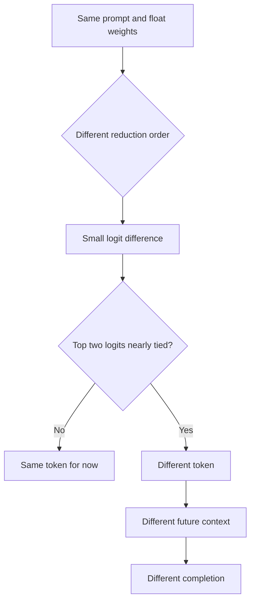
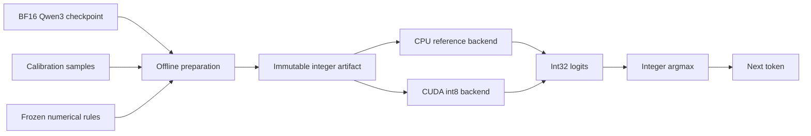
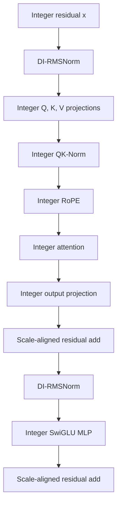
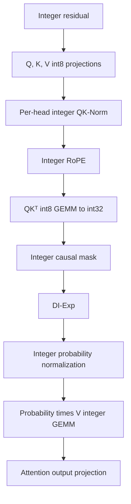
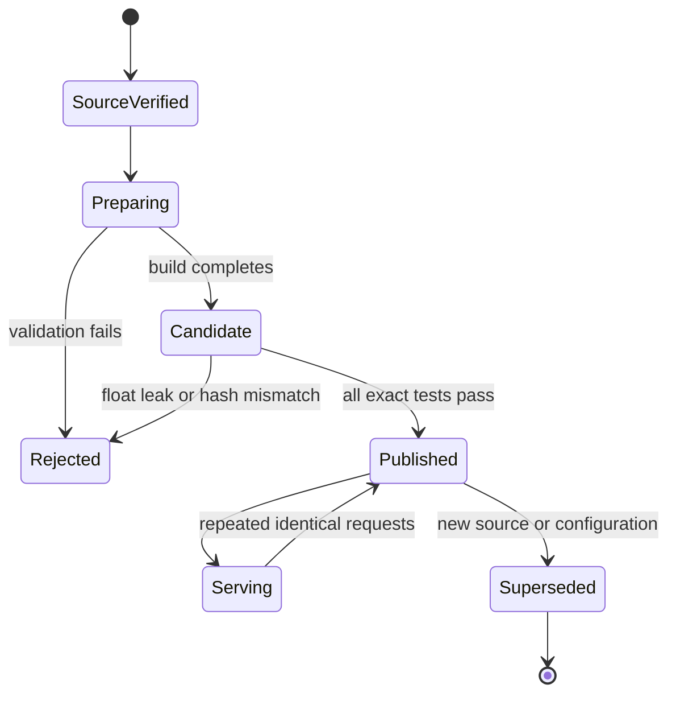

# DetLLM: Bit-Exact, Idempotent Integer-Only LLM Inference

> Written and explained by **Rishabh Gupta**  
> Google Developer Expert — Machine Learning, Google Cloud Platform, and JAX

This document explains how DetLLM converts a floating-point Qwen3-0.6B checkpoint into an immutable integer artifact and then produces bit-identical logits across repeated runs, batch layouts, prefill/decode paths, and supported CPU/GPU backends.

The goal is **deterministic inference**, not merely smaller weight storage.

---

## 1. What “idempotent” means here

The word has two related meanings that should not be mixed together.

### 1.1 Request-level idempotency

For a fixed model artifact, tokenizer, input token sequence, decoding policy, and runtime semantics:

```text
same request + same artifact + same rules
                    |
                    v
       same integer logits and tokens
```

Formally, if `F` is deterministic inference:

```text
F(artifact_hash, token_ids, decode_config) = exactly the same output bits
```

This must remain true when the hardware backend, batch composition, or prefill/decode schedule changes.

### 1.2 Update-level idempotency

An update operation `U` is mathematically idempotent when:

```text
U(U(W)) = U(W)
```

Ordinary quantization and smoothing are not automatically idempotent when repeatedly applied to their own outputs. DetLLM therefore obtains **operational idempotency** by treating preparation as an immutable build:

1. Always begin from the same immutable BF16 source revision.
2. Pin the calibration corpus, preparation configuration, code version, and rounding rules.
3. Produce a new immutable integer artifact.
4. Address the artifact by its SHA-256 hash.
5. Reuse the artifact when the manifest already matches.
6. Never run preparation on an already prepared integer artifact.

The floating-point preparation stage is not promised to be bit-identical across different machines. Cross-machine comparisons must therefore use the **same prepared artifact**, not independently rebuild it.

---

## 2. Why floating-point inference can disagree

Floating-point numbers have limited precision. Every operation may round.

For floating point:

```text
(a + b) + c  may not equal  a + (b + c)
```

For exact integers, provided no overflow occurs:

```text
(a + b) + c  =  a + (b + c)
```

A GPU kernel may change its reduction order because of:

- batch size;
- co-batched prompts;
- prefill versus one-token decode;
- GPU architecture;
- kernel-selection heuristics;
- tiling, split-K reductions, or atomics;
- framework and compiler decisions.

Even greedy decoding can diverge. A small logit difference can reverse two nearly tied vocabulary scores. Once a different token is selected, every later autoregressive input is different.



DetLLM removes floating-point arithmetic from the runtime numerical path. Integer operations, explicit rounding, explicit saturation, and frozen tie-breaking define one canonical result.

---

## 3. The complete architecture



Only the offline preparation stage may use floating point. Runtime loads integer tensors and integer metadata only.

### Runtime dtype policy

| Data | Runtime dtype | Reason |
|---|---:|---|
| GEMM inputs and most stored weights | `int8` | Supported by integer tensor-core matmul |
| GEMM accumulators and activations | `int32` | Prevents immediate overflow during reductions |
| Dyadic multiplier products and integer square-root inputs | `int64` | Provides room for scale arithmetic |
| RoPE lookup tables | `int16` | Fixed-point sine/cosine precision |
| Logits | `int32` plus dyadic scale | Argmax does not require conversion to float |
| Runtime floating point | Forbidden | Prevents platform-dependent numerical behavior |

---

## 4. Qwen3-0.6B structure

The model has:

- 28 Transformer blocks;
- hidden dimension `1024`;
- 16 query heads;
- 8 key/value heads;
- head dimension `128`;
- QK-Norm in addition to ordinary RMSNorm;
- SwiGLU feed-forward networks;
- rotary position embeddings;
- tied input embedding and LM-head source weights.

One block is conceptually:



---

## 5. Exactly which weights and constants change

Preparation does not update weights with gradient descent. It performs closed-form smoothing, folding, quantization, and constant generation.

### 5.1 Global model components

| Component | Offline change | Runtime representation |
|---|---|---|
| Input embedding | Quantized per vocabulary row | `int8` row plus per-row dyadic `(m, k)` |
| Final RMSNorm γ | Folded into a separate LM-head weight copy | No float γ on the final runtime path |
| LM head | Separately quantized per output channel | `int8` weight plus dyadic scales |
| RoPE | Sine/cosine generated offline | `int16`, typically with fixed fractional bits |
| Tie-breaking | Frozen rule | Lowest token ID among equal maximum logits |

The embedding and LM head begin from tied floating-point weights, but the integer artifact keeps separate forms because their scale layouts differ.

### 5.2 Every Transformer block, layers 0 through 27

| Block component | What changes during preparation |
|---|---|
| Pre-attention RMSNorm γ | Folded into the input columns of Q, K, and V projection weights |
| Q projection | Analytically smoothed where configured, then per-output-channel quantized |
| K projection | QK smoothing folded into weights; quantized; static K-cache scales calibrated |
| V projection | Quantized; static V-cache scales calibrated |
| QK-Norm γ | Converted to a per-channel dyadic integer multiplier because it cannot safely be folded through RoPE |
| Attention output projection | Activation/output smoothing folded where configured, then quantized |
| Pre-MLP RMSNorm γ | Folded into gate and up-projection input columns |
| Gate projection | Smoothed where configured and per-output-channel quantized |
| Up projection | Smoothed where configured and per-output-channel quantized |
| Down projection | Per-output-channel quantized; output smoothing may be folded according to the artifact configuration |
| Residual scales | Per-layer integer alignment constants generated |
| Attention score scale | `1/sqrt(head_dim)` and K-scale terms folded into dyadic metadata |

### 5.3 What is not stored as floating point

The integer runtime must not load float versions of:

- Q, K, V, or attention-output weights;
- gate, up, or down MLP weights;
- embedding or LM-head weights;
- RMSNorm multipliers;
- activation scales;
- RoPE tables;
- softmax constants.

---

## 6. First worked example: a 2D weight tensor

Production DetLLM uses int8. This example uses a tiny signed 4-bit range `[-7, 7]` so that the changes are visible.

Start with an integer-valued floating-point source matrix:

```text
W_source = [ 12  -4 ]    shape = [2 output channels, 2 input channels]
           [  3   7 ]
```

Choose one scale per output row.

For row 0, use the dyadic scale:

```text
s0 = 7 / 4 = 1.75
```

For row 1:

```text
s1 = 1 = 1 / 1
```

Quantize with one frozen rounding rule:

```text
q = clamp(round(W / s), -7, 7)
```

Row 0:

```text
12 / 1.75 = 6.857... ->  7
-4 / 1.75 = -2.285... -> -2
```

Row 1:

```text
3 / 1 = 3
7 / 1 = 7
```

The stored integer weight becomes:

```text
W_q = [ 7  -2 ]
      [ 3   7 ]
```

The artifact also stores the exact dyadic scales:

```text
row 0: m=7, k=2  because  m / 2^k = 7/4
row 1: m=1, k=0  because  m / 2^k = 1
```

Approximate reconstructed values are:

```text
row 0: [7, -2] * 7/4 = [12.25, -3.5]
row 1: [3,  7] * 1   = [ 3.00,  7.0]
```

Quantization introduces approximation error, but the stored integers and dyadic metadata define one exact runtime computation.

---

## 7. Integer matrix multiplication with the toy weights

Use an integer activation vector:

```text
x_q = [2, 1]     shape = [2]
```

The raw integer GEMM is:

```text
             [ 7  -2 ] [2]   [7*2 + (-2)*1]   [12]
W_q x_q  =  [ 3   7 ] [1] = [3*2 +    7*1 ] = [13]
```

The accumulator is `int32`:

```text
acc = [12, 13]
```

Each output channel currently has a different scale. Align them to a common scale of 1.

Row 0:

```text
round_half_away(12 * 7 / 4) = round_half_away(21) = 21
```

Row 1:

```text
round_half_away(13 * 1) = 13
```

Final aligned integer output:

```text
y_q = [21, 13]
```

The original unquantized multiplication would be:

```text
[ 12  -4 ] [2]   [20]
[  3   7 ] [1] = [13]
```

The first output differs by one because of quantization, but every correct runtime obtains the same `[21, 13]` from the prepared artifact.

```text
CPU:       [21, 13]
A100:      [21, 13]
H100:      [21, 13]
batch 1:   [21, 13]
batch 8:   [21, 13]
prefill:   [21, 13]
decode:    [21, 13]
```

---

## 8. Why dyadic scales matter

A dyadic scale is:

```text
s = m / 2^k
```

where `m` and `k` are integers.

Multiplication by `m` is integer multiplication. Division by `2^k` is a right shift with an explicitly defined rounding rule.

```text
real_value approximately equals integer_value * m / 2^k
```

Example:

```text
value = 11
m = 3
k = 2

scaled = round_half_away(11 * 3 / 4)
       = round_half_away(8.25)
       = 8
```

For a tie:

```text
value = 2
m = 3
k = 2

scaled = round_half_away(6 / 4)
       = round_half_away(1.5)
       = 2
```

Every backend must use the same tie rule. Calling the platform's default `round()` is not sufficient.

---

## 9. Analytic smoothing with a 2D example

Smoothing redistributes scale between an activation channel and the corresponding weight column without changing the ideal matrix product.

Start with:

```text
x = [8, 2]

W = [1   3]
    [2  -1]
```

Original output:

```text
W x = [1*8 + 3*2] = [14]
      [2*8 - 1*2]   [14]
```

Choose channel-smoothing factors:

```text
s = [2, 1]
```

Reduce the large activation channel:

```text
x_smooth = x / s = [4, 2]
```

Compensate by multiplying the corresponding weight columns:

```text
W_smooth = W * diag(s)

         = [2   3]
           [4  -1]
```

Now:

```text
W_smooth x_smooth

= [2*4 + 3*2] = [14]
  [4*4 - 1*2]   [14]
```

The ideal output is unchanged, but the activation range is easier to quantize.

Important: applying this fold repeatedly would keep multiplying the same weight columns. Therefore the operation should always be rebuilt from the immutable source checkpoint, or guarded by artifact metadata.

---

## 10. RMSNorm weight folding

Suppose a normalized vector `z` is multiplied by a learned channel vector `gamma` before a linear layer:

```text
y = W (gamma elementwise-multiplied by z)
```

The same result is:

```text
W_folded = W * diag(gamma)
y = W_folded z
```

For hidden-dimension RMSNorm, DetLLM folds `gamma` into the input columns of the following writer matrices:

```text
attention norm gamma -> Q, K, V input columns
MLP norm gamma       -> gate and up input columns
final norm gamma     -> separate LM-head input columns
```

QK-Norm gamma is different. RoPE mixes pairs of Q/K channels, so it cannot generally be moved through RoPE without changing the computation. It remains a runtime dyadic integer multiplication.

---

## 11. Integer attention



### Deterministic masking

Masked positions must:

- not participate in the row maximum;
- contribute exactly zero to the exponential sum;
- never use floating-point negative infinity;
- behave identically under different padding layouts.

### KV-cache rule

K and V are quantized exactly once when produced and then stored with their integer scale metadata.

```text
prefill K/V == decode K/V
```

Repeated requantization would introduce path-dependent rounding and violate prefill/decode invariance.

---

## 12. Integer nonlinear operators

Integer-only weights are not sufficient. The following operators must also avoid float:

| Float operation | Integer replacement |
|---|---|
| `exp()` | DI-Exp using shifts and integer interpolation |
| softmax | Row max, DI-Exp, integer sum, integer normalization |
| RMSNorm | Integer sum of squares and integer square root |
| SiLU/SwiGLU | Integer sigmoid approximation plus integer products |
| RoPE | Fixed-point sine/cosine table and rounded shifts |
| residual add | Dyadic scale alignment followed by `int32` addition |
| greedy argmax | Integer maximum with lowest-token-ID tie-break |

This is the difference between **integer storage** and **integer-only arithmetic**.

---

## 13. Safe accumulator bounds

For an int8 dot product of length `K`:

```text
maximum absolute product = 127 * 127 = 16,129
worst-case absolute sum  = K * 16,129
```

For `K = 1024`:

```text
1024 * 16,129 = 16,516,096
```

This fits in signed int32:

```text
2^31 - 1 = 2,147,483,647
```

Every GEMM site should calculate and assert its own bound from the model configuration. Exact integer arithmetic is useful only if overflow is also controlled.

---

## 14. An idempotent preparation contract

Use a build manifest such as:

```json
{
  "source_model": "Qwen/Qwen3-0.6B",
  "source_revision": "<immutable-commit>",
  "calibration_sha256": "<hash>",
  "prepare_code_revision": "<git-commit>",
  "rounding": "half-away-from-zero",
  "activation_quantization": "per-token-symmetric-int8",
  "weight_quantization": "per-output-channel-symmetric-int8",
  "qk_smoothing_alpha": "0.3",
  "rope_fractional_bits": 14,
  "artifact_format_version": 1
}
```

Derive a preparation key:

```text
prepare_key = SHA256(canonical_json(manifest))
```

Then use this algorithm:

```python
def prepare_idempotently(source_checkpoint, manifest, artifact_store):
    key = sha256(canonical_json(manifest))

    if artifact_store.has_verified(key):
        return artifact_store.get(key)

    assert source_checkpoint.dtype in {"bf16", "fp16", "fp32"}
    assert not source_checkpoint.is_prepared_integer_artifact

    artifact = build_integer_artifact_from_source(
        source_checkpoint,
        manifest,
    )

    validate_no_float_tensors(artifact)
    validate_operator_goldens(artifact)
    validate_determinism_suite(artifact)

    # Publish atomically. A partial artifact must never become visible.
    return artifact_store.put_if_absent(key, artifact)
```

This prevents accidental double smoothing, repeated quantization, and live in-place mutation.

---

## 15. Artifact lifecycle



Never overwrite a published artifact. A weight update creates a new version and new hash.

---

## 16. Determinism acceptance tests

All comparisons use zero numerical tolerance.

| Test | Comparison | Required result |
|---|---|---|
| Run-to-run | Same CUDA request repeated | Identical token IDs and every int32 logit |
| Batch invariance | Prompt alone versus batch sizes 2, 8, 32 | Identical row logits |
| Batch composition | Same prompt with different co-prompts | Identical row logits |
| Prefill/decode | Whole-prompt prefill versus token-by-token | Identical logits at every position |
| CPU/GPU | Reference integer CPU versus CUDA int8 | Bit-identical logits |
| GPU/GPU | A100 versus H100 with same artifact | Bit-identical logits |
| Long context | Several thousand tokens | Same exact invariants |
| Float leak | Observe every runtime tensor | No float tensor on numerical path |

### Hash-based verification

```text
step_hash_0 = SHA256(raw_int32_logits_0)
step_hash_n = SHA256(step_hash_(n-1) || raw_int32_logits_n)
```

The final chain hash commits to the entire ordered logit sequence. Hash token IDs separately because identical tokens can hide different logits.

---

## 17. Distributed and real-time serving considerations

### Dynamic batching

Activation scales must be per token, not computed from the whole batch. Otherwise one customer's large activation can change another customer's scale and output.

```text
incorrect: scale = max(abs(entire_batch)) / 127
correct:   scale[token] = max(abs(token_vector)) / 127
```

### Tensor parallelism

Integer partial sums remain exact, but collective semantics must define:

- accumulator dtype;
- overflow limits;
- scale ownership;
- reduction and slicing rules;
- zero padding;
- tie-breaking after sharded logits.

### Continuous batching

Sequence admission and eviction must not alter another sequence's scales, masks, KV-cache values, or logits.

### Speculative decoding

Both the draft and verifier paths require frozen integer semantics. Acceptance comparisons must use exact integer logits or a fully specified integer decision rule.

### Model rollout

Route by artifact hash, not a mutable model name alone:

```text
detllm-qwen3-0.6b-int8@sha256:<full-hash>
```

Log the hash with every request so an output can be reproduced later.

---

## 18. Performance and memory

### Weight memory

Ignoring scale metadata:

```text
BF16: 2 bytes per weight
int8: 1 byte per weight
```

For 600 million parameters:

```text
BF16 raw weights ≈ 1.2 GB
int8 raw weights ≈ 0.6 GB
```

The actual artifact includes scales, separate embedding/LM-head forms, RoPE tables, and constants.

### GEMM work

For matrix multiplication:

```text
[M, K] x [K, N] -> [M, N]
```

Approximate operation count:

```text
2 * M * K * N integer operations
```

The integer GEMMs may be fast, while requantization, scale alignment, normalization, and softmax can become limited by memory traffic and kernel-launch overhead.

Correct optimization order:

1. Freeze exact arithmetic semantics.
2. Pass reference-backend goldens.
3. Pass all determinism tests.
4. Profile.
5. Fuse integer elementwise operators.
6. Re-run every exact test after each optimization.

---

## 19. Common mistakes

- Quantizing weights but dequantizing them before each GEMM.
- Leaving RMSNorm, softmax, SiLU, or RoPE in floating point.
- Computing one activation scale for an entire batch.
- Requantizing cached K/V during incremental decode.
- Relying on backend-default rounding.
- Depending on backend-default `argmax` tie behavior.
- Applying smoothing to an already smoothed artifact.
- Preparing independently on multiple machines and assuming identical bytes.
- Comparing only generated tokens instead of every raw integer logit.
- Using int32 without proving accumulator bounds.
- Allowing a compiler optimization to change rounding or saturation order.

---

## 20. Minimal project layout

```text
src/detllm/
  intmath.py       canonical integer division, shifts, rounding, clamps
  dyadic.py        integer data plus (m, k) scale bookkeeping
  backends.py      the only backend-specific GEMM dispatch
  ops/
    exp.py         DI-Exp
    softmax.py     integer softmax
    rmsnorm.py     integer RMSNorm and QK-Norm
    swiglu.py      integer SwiGLU
    rope.py        fixed-point RoPE
  model.py         integer Qwen3 runtime
  prepare.py       offline calibration, folding, and quantization
  guard.py         float-leak detection
tests/
  test_intmath.py
  test_operators.py
  test_determinism.py
scripts/
  demo.py
  bench.py
  perplexity.py
```

---

## 21. Usage

```bash
uv sync
make prepare
make test
make test-all
make ppl
```

For cross-machine validation, use the same published artifact rather than rebuilding it:

```bash
hf download nathanbarry/detllm-qwen3-0.6b-int8 \
  --local-dir artifacts/qwen3-0.6b-int8
```

Generate greedily:

```python
from detllm.model import IntQwen3
from transformers import AutoTokenizer

tokenizer = AutoTokenizer.from_pretrained("Qwen/Qwen3-0.6B")
model = IntQwen3(
    "artifacts/qwen3-0.6b-int8",
    backend="cuda",  # or reference/cpu
)

input_ids = tokenizer(
    "The capital of France is",
    return_tensors="pt",
).input_ids

generated_ids, integer_logits = model.generate(
    input_ids.cuda(),
    max_new=50,
)

print(tokenizer.decode(generated_ids[0]))
```

---

## 22. Interview-ready summary

| Question | Short answer |
|---|---|
| Why can temperature-zero inference differ? | Floating reductions can run in different orders and round differently. |
| Why is ordinary int8 quantization insufficient? | Many stacks dequantize for GEMMs or keep nonlinear operations in float. |
| What makes DetLLM deterministic? | Integer-only runtime, frozen rounding, exact accumulation, per-token scales, fixed masking, and fixed tie-breaking. |
| Which weights change? | Embedding, Q/K/V/O, gate/up/down, and LM-head representations are smoothed/folded and quantized offline. |
| Why per-token activation scaling? | It prevents batch members from changing each other's numerical scale. |
| Why quantize K/V once? | Requantization would make prefill and decode follow different rounding paths. |
| Is preparation cross-machine bit deterministic? | Not guaranteed; prepare once and distribute the immutable artifact by hash. |
| How are updates made idempotent? | Rebuild only from an immutable source and deduplicate with a canonical manifest key. |
| What is the strongest test? | CPU and GPU produce exactly the same int32 logits for the same artifact. |

---

## 23. Sources and further reading

- [DetLLM repository provided with this write-up](https://github.com/rishabh135/idempotent_llm)
- [DetLLM technical specification](https://github.com/nathanrs/detllm/blob/main/docs/SPEC.md)
- [DetLLM results](https://github.com/nathanrs/detllm/blob/main/docs/RESULTS.md)
- [DetLLM design notes](https://github.com/nathanrs/detllm/blob/main/docs/NOTES.md)
- [I-LLM: Efficient Integer-Only Inference for Fully-Quantized Low-Bit LLMs](https://arxiv.org/abs/2405.17849)
- [PyTorch reproducibility notes](https://pytorch.org/docs/stable/notes/randomness.html)
- [Qwen3-0.6B model page](https://huggingface.co/Qwen/Qwen3-0.6B)

---

## Author

**Rishabh Gupta**  
Google Developer Expert — Machine Learning, Google Cloud Platform, and JAX

