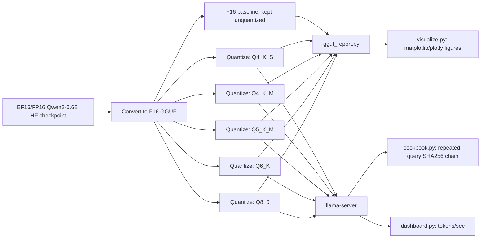
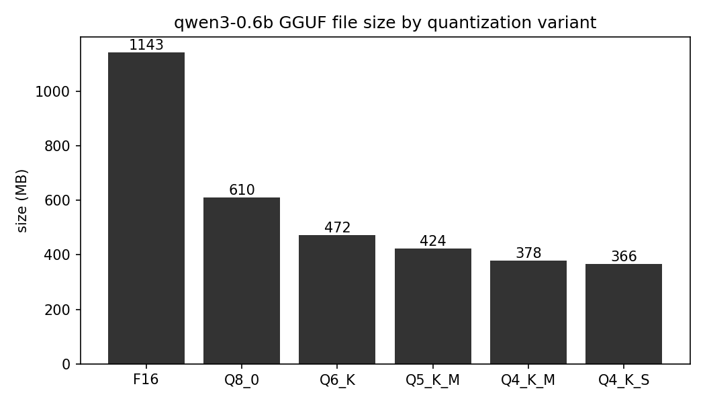
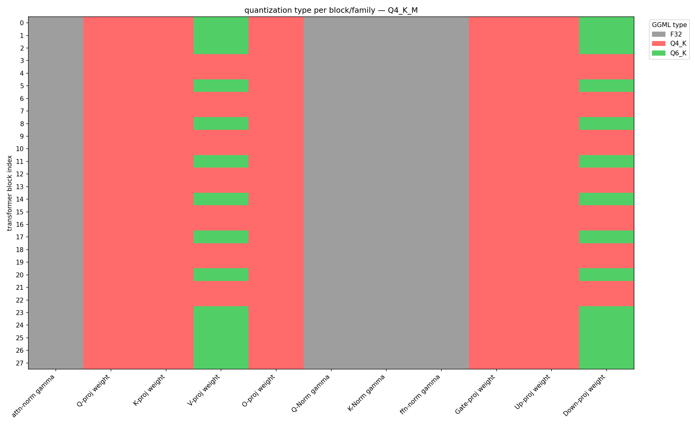
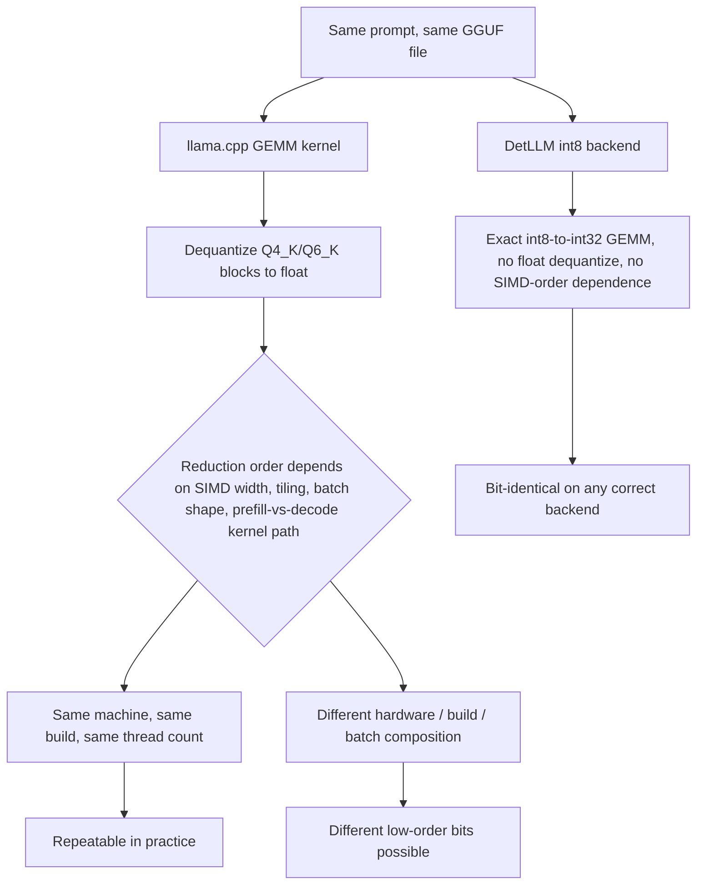

# GGUF / llama.cpp Quantization vs. DetLLM's Dyadic Int8: A Worked Comparison on Qwen3-0.6B

> Written and explained by **Rishabh Gupta**  
> Google Developer Expert — Machine Learning, Google Cloud Platform, and JAX

**Scope note.** This document compares how llama.cpp/GGUF quantizes Qwen3-0.6B
against how this repo's own [`prepare.py`](../src/detllm/prepare.py)/
[`dyadic.py`](../src/detllm/dyadic.py) pipeline quantizes the same model. It
does not claim GGUF/llama.cpp quantization is bad or wrong — it is a mature,
widely used, well-engineered scheme optimized for a different objective
(minimizing quantization error per bit, across arbitrary consumer hardware,
with a mixed-precision heuristic). What it *does* claim, concretely: GGUF's
kernels dequantize blocks to floating point inside the GEMM and reduce in an
order that depends on SIMD width, tiling, and hardware, so a llama.cpp model
does not carry this repo's cross-hardware, cross-batch, prefill/decode-
invariant, bit-exact guarantee — even though it can be perfectly repeatable
run-to-run on one fixed machine and build. Read
[`deep-dive/README.md`](../deep-dive/README.md) first for the general "why
floating point disagrees" argument; this document specializes that argument
to GGUF specifically, with real data generated from the real model.

---

## 1. Why put GGUF next to DetLLM at all

llama.cpp/GGUF is the most widely deployed quantization format for running
LLMs locally and on commodity hardware. Qwen3-0.6B — this repo's own model —
already has official and community GGUF releases, so this isn't a strawman
comparison against some toy format; it's the format most people would
actually reach for to run this exact model on a laptop.

By the end of this document you should be able to answer two questions:
(1) structurally, how does GGUF's block quantization differ from this repo's
per-channel dyadic quantization, and (2) why does that structural difference
translate into a different *determinism* guarantee, not just a different
file size. Section 12's table is the answer to (2) in one place; everything
before it builds the case for why that table says what it says.

---

## 2. Bit budgets from scratch

A **bit** is the smallest unit of information a computer stores — one binary
digit, 0 or 1. A **bit budget** for a number is how many bits you spend
describing it. Spend more bits, and you can represent more distinct values
precisely; spend fewer, and many different real numbers must round to the
same stored value.

| Format | Bits/weight | What the bits buy you |
|---|---:|---|
| FP32 | 32 | 1 sign bit + 8 exponent bits + 23 mantissa bits — huge dynamic range, most precise, heaviest |
| FP16 | 16 | 1 sign + 5 exponent + 10 mantissa — half the memory of FP32, narrower range/precision |
| INT8 | 8 | 256 distinct integer codes total — needs a separate "scale" number to map codes back to real values |
| INT4 | 4 | only 16 distinct integer codes total — needs the scale (and often a *block* of them) even more |

The one idea the rest of this document builds on: **compressing a weight
into fewer bits loses precision because fewer bits means fewer distinct
representable codes in total** — many different real numbers get mapped to
the same stored code, and that mapping is lossy in both directions
(quantize, then dequantize, and you get back something close to but not
exactly the original value).

When you only have very few codes — INT4's 16, for instance — you get much
better results if you don't force *one* scale to cover an entire tensor.
Instead, split the tensor into small groups ("blocks") and give each group
its own scale, since nearby values in a tensor are more likely to share a
similar range than values scattered across the whole thing. That's the seed
both GGUF's scheme and (in a very different way) this repo's own per-channel
scheme grow out of — the concrete difference between the two is section 6's
subject.

---

## 3. What "block quantization" means, in general

A **block** is a small, fixed-size, contiguous run of values inside a tensor
(GGUF's K-quants use 32 values per sub-block — see section 4) that all share
one scale, and possibly a second number, a **min** (or "zero-point"), if the
scheme is *affine* rather than *symmetric*.

- **Symmetric**: one scale, codes map to `code * scale`, and the real value
  zero maps exactly to code 0. Simple, but wastes codes if the block's
  values aren't centered near zero.
- **Affine (asymmetric)**: a scale AND a minimum, codes map to
  `min + code * scale`. Uses the whole code range more efficiently for
  skewed/non-zero-centered data, at the cost of storing one extra number per
  block.

Granularity, coarsest to finest:

- **per-tensor** — one scale for millions of values. Coarsest, cheapest.
- **per-channel/per-row** — one scale per output row. This repo's own
  scheme (section 6).
- **per-block** — one scale per small group inside a row. GGUF's K-quants
  (section 4) — one level finer than per-channel.

---

## 4. GGUF's K-quant scheme in real terms

K-quants organize weights into **super-blocks of 256 values**, each split
into **8 sub-blocks of 32 values**. Each sub-block gets its own small scale
(and, for the affine variants, its own min); the super-block additionally
stores one shared reduced-precision "scale of the scales" and "scale of the
mins," so the 8 per-sub-block numbers don't each need to be a full FP16.

```text
super-block (256 weight values)
[ sub-block 0 (32 values) ][ sub-block 1 (32 values) ] ... [ sub-block 7 (32 values) ]
      scale0 + min0              scale1 + min1                    scale7 + min7
                     \                 |                  /
                      one shared "d"  (scale-of-scales)
                      one shared "dmin" (scale-of-mins)
```

Forward-reference to section 6: DetLLM has no analogous nested block
structure at all — one scale per output channel, full stop, no per-32-value
sub-grouping, no separate min term.

Names relevant to this lab (a fuller glossary is in section 14):
**Q4_K**, **Q5_K**, **Q6_K**, **Q8_0**, and the `_S`/`_M` suffix, which
nominally means "uniform" vs. "mixed-precision, some tensors bumped up" —
section 8 below shows the real picture is a bit more nuanced than that
suffix suggests.

---

## 5. Worked toy example: GGUF-style block quantization by hand

Real K-quants use 32-value sub-blocks inside 256-value super-blocks. This
toy example shrinks both by the same ~32× factor so the arithmetic stays
hand-computable, while keeping the identical *nested* structure: two
sub-blocks, each with its own scale+min.

```text
W = [-4, 12, -2, 6, 3, -5, 9, 1]
sub-block A = [-4, 12, -2, 6]      sub-block B = [3, -5, 9, 1]
```

Real K-quants use **unsigned 4-bit codes in [0, 15]** with an affine
(min + scale) formula:

**Sub-block A:**
```text
min_A = -4, max_A = 12, range_A = 16, scale_A = 16 / 15 = 1.0667

q(-4) = round((-4 - (-4)) / 1.0667) = round(0)      = 0
q(12) = round((12 - (-4)) / 1.0667) = round(15.0)   = 15
q(-2) = round((-2 - (-4)) / 1.0667) = round(1.875)  = 2
q(6)  = round(( 6 - (-4)) / 1.0667) = round(9.375)  = 9

dequantize (min + q·scale): -4.0, 12.0, -1.867 (true -2, err +0.13), 5.6 (true 6, err -0.4)
```

**Sub-block B:**
```text
min_B = -5, max_B = 9, range_B = 14, scale_B = 14 / 15 = 0.9333

q(3)  = round((3 - (-5)) / 0.9333)  = round(8.571)  = 9
q(-5) = round(0)                                     = 0
q(9)  = round((9 - (-5)) / 0.9333)  = round(15.0)   = 15
q(1)  = round((1 - (-5)) / 0.9333)  = round(6.429)  = 6

dequantize: 3.4 (true 3, err +0.4), -5.0, 9.0, 0.6 (true 1, err -0.4)
```

Four stored numbers (2 scales + 2 mins) for eight weight values. Real
K-quants additionally 6-bit-pack each sub-block's scale/min and share one
FP16 super-block "scale of scales"/"scale of mins" — this toy walkthrough
shows the *two-level grouping and affine-formula* idea, not the exact bit
layout; see section 18's sources for the real GGUF format spec.

---

## 6. The bridge: the same tensor through DetLLM's scheme

Same 8 values, now treated as **one output channel/row** — DetLLM has no
sub-block splitting at all, and that absence is the whole point. Reusing the
same toy signed 4-bit range `[-7, 7]` as
[`deep-dive/README.md`](../deep-dive/README.md) §6, DetLLM's actual
`(data, m, k)` dyadic convention from [`dyadic.py`](../src/detllm/dyadic.py)
(real value ≈ `data · m / 2^k`):

```text
W = [-4, 12, -2, 6, 3, -5, 9, 1]
max|w| = 12
ideal scale = 12 / 7 = 1.7143
dyadic fit: m=7, k=2  ->  s = 7/4 = 1.75   (same (m, k) convention as dyadic.py)
q = clamp(round(w / 1.75), -7, 7)
```
```text
q(-4)=-2   q(12)=7   q(-2)=-1   q(6)=3   q(3)=2   q(-5)=-3   q(9)=5   q(1)=1

dequantize (q * 1.75): -3.5 (err +0.5), 12.25 (err +0.25), -1.75 (err +0.25), 5.25 (err -0.75), 3.5 (err +0.5), -5.25 (err -0.25), 8.75 (err -0.25), 1.75 (err +0.75)
```

| | GGUF-style (2 sub-blocks) | DetLLM-style (1 channel) |
|---|---|---|
| Stored scale parameters for these 8 values | 4 (`scale_A, min_A, scale_B, min_B`) | 2 (`m=7, k=2`) |
| Zero-point / min term | Yes (affine) | No (symmetric — real 0 maps to code 0 exactly) |
| Max absolute reconstruction error (this example) | 0.4 | 0.75 |
| Sum of absolute reconstruction error (this example) | 1.33 | 3.5 |
| What grows with tensor size | One extra (scale, min) pair per additional 32-value sub-block | Nothing — still exactly one `(m, k)` pair no matter how long the row is |

**Non-adversarial framing, stated plainly:** GGUF's finer per-sub-block
grouping achieves lower per-value error on this toy tensor — expected,
since it's a strictly more expressive representation (more stored
parameters). DetLLM accepts a bit more per-value quantization error in
exchange for (a) a fixed, tiny metadata cost per channel regardless of
channel width (real number, from
[`quant-report/README.md`](../quant-report/README.md): one `I64` mantissa
row like `Q-proj scale [2048]` covers an *entire* 1024×2048 weight, versus
GGUF's one scale+min per 32 values), and (b) — the actual point — a
symmetric, no-zero-point, per-channel scale that composes with **exact
integer GEMM** end to end, which sections 11–12 build on. This is a
different design objective (minimize error-per-bit vs. make the runtime
arithmetic exact and hardware-portable), not a quality ranking.

---

## 7. Architecture of the comparison lab



Deliberate parallel to `prepare.py`: everything starts from ONE immutable
source checkpoint, and every quantized variant is an independent,
reproducible build from that same source — never variant-from-variant
(`llama-quantize` always runs against the F16 file, per
[PLAN.md](PLAN.md) §3).

---

## 8. Real model: which quant type lands on which tensor

This section reports what the real, locally-produced `qwen3-0.6b-Q4_K_S.gguf`
and `qwen3-0.6b-Q4_K_M.gguf` files actually contain (via
[`gguf_report.py`](gguf_report.py)'s per-layer table), not the commonly
cited simplification. The oft-repeated shorthand is "Q4_K_S = uniform Q4_K
everywhere; Q4_K_M = Q4_K everywhere except `attn_v`/`ffn_down`, which get
bumped to Q6_K on about half the layers." The real numbers from this build
(llama.cpp commit `d230ddd763ff`) are close to that story but not identical
to it:

| Block tensor | Q4_K_S (real) | Q4_K_M (real) |
|---|---|---|
| `attn_q`, `attn_k`, `attn_output` | Q4_K (all 28 layers) | Q4_K (all 28 layers) |
| `attn_v` | Q4_K on 24/28 layers, **Q5_K on 4/28** | Q4_K on 14/28 layers, **Q6_K on 14/28** |
| `ffn_gate`, `ffn_up` | Q4_K (all 28 layers) | Q4_K (all 28 layers) |
| `ffn_down` | Q4_K on 25/28 layers, **Q5_K on 3/28** | Q4_K on 14/28 layers, **Q6_K on 14/28** |
| `token_embd` (also serves as the LM head — see below) | Q6_K | Q6_K |
| all norm tensors (`attn_norm`, `attn_q_norm`, `attn_k_norm`, `ffn_norm`, `output_norm`) | F32 | F32 |
| `general.file_type` (internal preset id) | **14** | **15** |

In Q4_K_M, both `attn_v` and `ffn_down` are promoted to Q6_K on exactly the
same 14 block indices: `0, 1, 2, 5, 8, 11, 14, 17, 20, 23, 24, 25, 26, 27`
(read directly from `gguf_report.py`'s per-layer table, not estimated) — the
list section 10's heatmap makes visible at a glance.

So **Q4_K_S is not perfectly uniform** — it already promotes a handful of
`attn_v`/`ffn_down` tensors to Q5_K, just far fewer than Q4_K_M promotes to
the higher Q6_K. Comparing the two files directly
(`gguf_report.py --compare ...Q4_K_S.gguf ...Q4_K_M.gguf`), **29 of 310
tensors changed type** — 15 `attn_v.weight` and 14 `ffn_down.weight` — and
`--assert-known-asymmetry` confirmed every single one of those 29 is in the
expected `attn_v`/`ffn_down` set (PASSED). The 15-vs-14 split (not a clean
14-and-14) is itself real: some layers promoted in one file aren't promoted
identically in the other, so a layer can go Q5_K→Q6_K, Q4_K→Q6_K, or even
Q5_K→Q4_K between the two files, all counted as "changed." This is a genuine
finding, not a simplification error — quantization-level heuristics in
production code are a *gradient*, not the clean binary a one-line summary
suggests.

The `general.file_type` values (14 for Q4_K_S, 15 for Q4_K_M) are exactly
the internal preset-id pattern visible in the original screenshot that
motivated this lab (`[14]` vs `[18]` there, for a different pair of presets)
— the same mechanism, different numbers, because these are different quant
type pairs.

**Why `attn_v`/`ffn_down` specifically?** Both feed directly into the
residual stream — `attn_v` through the attention output projection,
`ffn_down` as the MLP's own output projection — so empirically they are more
precision-sensitive than `attn_q`/`attn_k` (which only shape attention
scores) or `ffn_gate`/`ffn_up` (internal MLP expansion). Q4_K_M spends its
extra bits where it protects output quality most, for roughly the storage
cost of upgrading about half the model's `attn_v` + `ffn_down` tensors.
Interestingly, [`abliteration/PRINCIPLES.md`](../abliteration/PRINCIPLES.md)
§13 singles out almost the identical set — attention-output and MLP-down
projections — as the components that write to the residual stream, for a
related but distinct reason (that's *where* to intervene to change model
behavior, not where precision loss hurts quality most) — worth noticing the
overlap, not a coincidence: both analyses are asking "which weight matrices
have an outsized effect on the residual stream," just for different
purposes.

**The LM head isn't a separate tensor here.** Unlike this repo's own int8
artifact — which stores `embed.e8` and `head.w8t` as two *separately*
quantized tensors despite the original model tying them (see
`quant-report/README.md`) — the real GGUF file has no `output.weight`
tensor at all. `token_embd.weight` (kept at Q6_K in both Q4_K_S and Q4_K_M)
serves double duty as both the embedding table and the LM head, exactly
mirroring Qwen3-0.6B's `tie_word_embeddings: true` config. This is a real,
verified structural difference between the two projects' approaches to the
same tied-weight architecture, not a detail either got "wrong."

---

## 9. Real model: size and bits/weight across all 6 variants + DetLLM

Real numbers, computed by `gguf_report.py` from the actual produced files
(never estimated) — bits/weight here means *total bytes stored × 8 ÷ total
weight elements*, i.e. it already includes each scheme's own per-block or
per-channel metadata overhead, the same way DetLLM's own 8.32b figure
already includes its scale/mantissa overhead:

| Variant | Real bits/weight | Real file size | vs. F16 (this lab) |
|---|---:|---:|---:|
| F16 (conversion baseline) | 16.00 | 1142.68 MB | 1.00x |
| Q8_0 | 8.50 | 609.82 MB | 1.87x smaller |
| Q6_K | 6.57 | 472.17 MB | 2.42x smaller |
| Q5_K_M | 5.88 | 423.83 MB | 2.70x smaller |
| Q4_K_M | 5.24 | 378.33 MB | 3.02x smaller |
| Q4_K_S | 5.06 | 365.51 MB | 3.13x smaller |
| DetLLM int8 (this repo, `quant-report/README.md`) | 8.32 | 745.10 MB | *(see footnote)* |

*Footnote: DetLLM's "1.53× smaller than fp16" figure in `quant-report/README.md`
is against an **equivalent fp16 checkpoint size estimated from its own
architecture parameter count** (596,049,920 tied params × 2 bytes = 1.11
GB), not literally this lab's F16 GGUF file — the two F16 baselines happen
to be extremely close (1.11 GB vs. this lab's 1.12 GB; the small difference
is GGUF's own header/metadata overhead) but are not the same file, so the
ratios in this table's rightmost column and DetLLM's own published ratio
are not directly interchangeable — both are computed the same *way*, just
against slightly different F16 references.*

Two things worth noticing that a "GGUF is smaller" headline alone would
miss. **All six GGUF variants total the same 596,049,920 weight
elements** — exactly DetLLM's own "original checkpoint parameters (tied,
bf16)" figure, confirmed independently: `llama-server`'s own `/v1/models`
endpoint reports `"n_params": 596049920` for the real running Q4_K_M model,
character-for-character the same number `quant-report/README.md` already
published. Two completely different quantization pipelines, built by
different tooling, agree exactly on the true parameter count of the
underlying tied-weight model — a small but genuine cross-check. Second: at
its real 8.32 bits/weight, DetLLM's int8 artifact sits *between* GGUF's
Q6_K (6.57b) and Q8_0 (8.50b) on this table, despite being described as
"int8" — the untied embed+head storage (311,164,928 of 751,566,848 stored
weight elements, 41% — raw counts from `quant-report/README.md`, percentage
per the main [README](../README.md)) and the rope/scale bookkeeping overhead
push its effective bits/weight up from the nominal 8, the same way GGUF's
own block overhead pushes each K-quant type above its nominal bit-width
(Q4_K_M's nominal "4-bit" lands at a real 5.24b, for the identical reason:
metadata isn't free in either scheme).



---

## 10. Real model: per-layer × per-tensor-family heatmap

The table in section 8 states the promotion pattern in words; this heatmap
is the same real data, visually, across every one of the 28 blocks at once
— rows are block index 0–27, columns are the 11 per-block tensor families,
color is the real GGML quantization type read directly from the file (never
inferred). The `V-proj weight` and `Down-proj weight` columns show the
green (Q6_K) cells landing on exactly the 14 block indices named in section
8 (0, 1, 2, 5, 8, 11, 14, 17, 20, 23, 24, 25, 26, 27) — everything else
stays uniformly red (Q4_K), and the norm columns are a uniform gray (F32).



*Source files: `llamacpp-quant-lab/artifacts/qwen3-0.6b-Q4_K_M.gguf`
(sha256 `c974d814f88ecb3e…`). Generated by
`visualize.py --gguf-dir llamacpp-quant-lab/artifacts`.*

---

## 11. Why GGUF's kernels don't give DetLLM's guarantee — the mechanism



`deep-dive/README.md` §2 already establishes the general mechanism:
floating-point reduction order is not associative, so different orderings
can produce different low-order bits. GGUF's K-quant kernels dequantize
each block back to a floating-point value inside (or immediately before)
the GEMM's inner loop, then accumulate in float using whatever SIMD
width/instruction set (AVX2/AVX-512/NEON) or GPU shader (Metal/CUDA) the
specific build targets. Because that accumulation order depends on batch
shape, thread count, tiling, and whether the kernel is a prompt-processing
(prefill) or single-token (decode) code path, it can change the low-order
bits of the result.

The important nuance: on ONE fixed machine, with a fixed build and fixed
thread/batch settings, at temperature 0 (greedy), this reduction order is
typically *stable* run after run — a single deployed llama.cpp instance can
look fully deterministic in practice, and section 13's real cookbook run
confirms exactly that on this machine. That stability is the narrower
"same machine, same build" reading of `deep-dive/README.md` §1.1's
**request-level idempotency** — not the stronger cross-hardware/cross-batch
guarantee this repo's own [`scripts/demo.py`](../scripts/demo.py) proves
across an A100, an H100, and plain CPU reference kernels, printed in the
main [README](../README.md)'s own hash table.

DetLLM never dequantizes to float anywhere on the runtime path; every GEMM
accumulation is exact `int8`→`int32` arithmetic, which is associative and
commutative on any correct hardware — so the same artifact produces the
same bits on CPU, A100, and H100, in any batch composition, regardless of
prefill/decode split.

---

## 12. The determinism guarantee matrix

| Guarantee tested | GGUF / llama.cpp (one build) | DetLLM int8 |
|---|---|---|
| Run-to-run, same machine, same build, greedy | Repeatable in practice — not architecturally guaranteed, but stable given fixed kernel dispatch and thread count | Bit-identical by construction |
| Batch composition (same prompt, different co-batched prompts) | Not guaranteed — kernel may select different tile/reduction shapes depending on batch shape; dequantizes to float internally | Bit-identical (per-token integer scale, exact accumulation) |
| Prefill vs. decode | Not guaranteed — separate prompt-processing and single-token kernel paths can use different SIMD reduction order | Bit-identical (K/V quantized exactly once; identical semantics both paths) |
| CPU vs. GPU (e.g. CPU BLAS vs. Metal/CUDA backend) | Not expected to match — entirely different float kernels and reduction order | Bit-identical (same exact int32 semantics on any correct backend) |
| Cross hardware vendor (Apple Silicon vs. x86 AVX vs. NVIDIA GPU) | Not expected to match — SIMD width, FMA order, and Metal vs. AVX differ | Bit-identical (integer addition is associative/commutative on any hardware) |
| Cross llama.cpp build/version | Not guaranteed — kernel-selection heuristics and quantization code can change between releases (section 8's own Q4_K_S/Q4_K_M finding is exactly this kind of build-dependent heuristic) | Bit-identical only for the *same* DetLLM artifact hash; a new `prepare.py` run is addressed by a new hash, never silently overwritten |

Every "not guaranteed" cell above describes an architectural absence of a
promise, not an observed bug — llama.cpp was never designed to make these
particular guarantees.

---

## 13. Determinism cookbook: what it proves and doesn't

[`cookbook.py`](cookbook.py) tests exactly the narrower notion
`deep-dive/README.md` §1.1 calls **request-level idempotency** — for a fixed
artifact (here, a fixed GGUF file), fixed decode policy, and fixed machine,
repeated identical requests return identical output.

**Real result, this machine, `qwen3-0.6b-Q4_K_M.gguf`, 20 repeated
requests, `n_predict=128`, `temperature=0`:**

```text
PASS: 20/20 runs byte-identical (final hash a380b042a7c6d771)
decode throughput across the 20 runs: 258.0–299.1 tok/s
```

The same run's `--with-int8-reference` cross-check against
`scripts/demo.py --config int8-cpu-b1 --steps 64`:

```text
pipeline                                    runs  identical?  guarantee class
llama.cpp GGUF (this lab)                     20         yes  request-level, THIS machine + build only
DetLLM int8 (scripts/demo.py)                  1   n/a (ref)  request-level AND cross-hardware/cross-batch/cross-backend
```

**What running it does NOT prove:** cross-hardware bit-exactness;
cross-batch-composition invariance; cross-llama.cpp-version stability; or
bit-exactness against DetLLM's own int32 logits (different arithmetic
entirely — a llama.cpp GGUF model and DetLLM's int8 model are not expected
to produce token-for-token identical output, only similar-quality output).
Full cross-hardware coverage for the GGUF side would require the same
multi-machine setup `scripts/demo.py` already uses for DetLLM — a heavier,
separate exercise this lab doesn't attempt.

This cookbook run demonstrates exactly the one cell in section 12's table
where GGUF *is* expected to succeed ("run-to-run, same machine, same
build") — worth saying explicitly so this section reads as confirming
precisely the guarantee GGUF does offer, not as debunking llama.cpp.

---

## 14. Glossary of GGUF quant-type names

| Name | Approx. bits/weight | Scheme family | One-line note |
|---|---:|---|---|
| F32 | 32 | float | Full precision; used only as a size/quality reference point |
| F16 | 16 | float | Half precision; this lab's conversion baseline before any quantization |
| Q8_0 | ~8.5 | legacy, per-block, symmetric | Simple round-to-nearest, no min term; near-lossless |
| Q4_0 / Q5_0 | 4 / 5 | legacy, per-block, symmetric | Predecessor to K-quants; one scale per 32-value block, no min |
| Q4_1 / Q5_1 | 4 / 5 | legacy, per-block, affine | Adds a min/zero-point to the `_0` family |
| Q4_K_S | ~5.1 (real, this model) | K-quant, mostly uniform | Mostly Q4_K; a handful of `attn_v`/`ffn_down` tensors bumped to Q5_K (section 8) |
| Q4_K_M | ~5.2 (real, this model) | K-quant, mixed-precision | Mostly Q4_K; roughly half of `attn_v`/`ffn_down` bumped to Q6_K (section 8) |
| Q5_K_M | ~5.9 (real, this model) | K-quant, mixed-precision | Same idea as Q4_K_M, one tier higher |
| Q6_K | ~6.6 (real, this model) | K-quant, uniform | Common "upgrade target" tensor type; highest-fidelity K-quant in everyday use |

Bits/weight above are the real, computed figures from section 9's table for
this specific model and this specific llama.cpp build — not a generic
industry ballpark. Different architectures (vocab size, hidden size, layer
count) will shift these slightly, since block/scale overhead is a smaller
fraction of a bigger tensor.

---

## 15. Installing and running the lab

**Prerequisites.** This lab needs a local llama.cpp build (for
`convert_hf_to_gguf.py` and `llama-quantize` — not available from the
`brew install llama.cpp` prebuilt path, which ships binaries only) and the
official `gguf` PyPI package for `gguf_report.py`'s `GGUFReader` — the same
"introspect via the real format library, don't hand-roll a parser" spirit
`scripts/quant_report.py` applies to safetensors headers.

**Build llama.cpp.** Pin matters here specifically: section 8's exact
promotion heuristic can change between llama.cpp versions, so the commit
actually used is recorded in `artifacts/llamacpp_build_info.json` and
folded into `manifest.json` — the same "immutable build, recorded by hash"
discipline `deep-dive/README.md` §14 applies to DetLLM's own preparation
manifest.

**Convert + quantize.** All 6 variants are generated from the SAME F16 GGUF
— never variant-from-variant — directly paralleling `prepare.py`'s "always
rebuild from the immutable source" rule.

**Report.** Produces the tables in sections 8–9, read directly from the
real files' headers — no weight data loaded, matching `quant_report.py`'s
own design.

**Visualize.** Produces the PNGs and interactive HTML referenced throughout
this document, checked in alongside the report (PNGs) or kept local-only
(interactive HTML, since GitHub can't render live plotly).

**Serve + front-end.** `llama-server` is a real inference endpoint for the
next two steps — its built-in web UI and OpenAI-API-compatible endpoint are
"the front end"; nothing custom was built on top of it.

**Determinism cookbook.** Runs section 13's repeated-query hash chain
against the running server.

**Dashboard.** A secondary, "performance aside" artifact — raw speed isn't
this lab's point (determinism is), so treat the tokens/sec numbers in
section 13 as context, not the headline.

---

## 16. Common misconceptions and failure modes

- Assuming "GGUF gave the same output twice on one laptop" means it would
  give the same output on a different machine.
- Assuming a higher-bit K-quant (e.g. Q6_K) is automatically "more
  deterministic" than a lower-bit one — bit-width and determinism guarantee
  are orthogonal; both dequantize to float internally.
- Comparing GGUF's nominal quant-type bit-width (e.g. "4-bit") directly
  against DetLLM's 8.32b/param without accounting for GGUF's own per-block
  scale/min overhead — section 9's table computes both the same way for
  exactly this reason.
- Assuming the Q4_K_M-vs-Q4_K_S tensor-bump pattern is fixed across
  llama.cpp versions or model architectures — section 8 shows it's a
  heuristic that doesn't even match the commonly cited simplification for
  this build.
- Running the determinism cookbook against ONE machine and citing it as
  proof of cross-hardware bit-exactness.
- Treating this document's toy example's exact numeric error findings
  (section 5) as evidence about the real 256/32-sized blocks — the toy
  shrinks scale, not the qualitative structure.
- Assuming DetLLM's own int8 pipeline would produce token-identical output
  to a GGUF Q8_0 model — different quantization means different (though
  hopefully close) outputs are expected; only DetLLM's *own* artifact is
  compared bit-for-bit across hardware.
- Forgetting that `token_embd` (also serving as the LM head here, per
  section 8) is frequently kept at higher precision even in the smallest
  GGUF variants — don't assume uniform quant type across every tensor just
  because the file is named "Q4_K_S."
- Confusing "F16 GGUF" in this lab with "the equivalent fp16 checkpoint"
  referenced in `quant-report/README.md`'s own size-ratio numbers — related,
  computed the same way, but not the same file (section 9's footnote).

---

## 17. Interview-ready summary

| Question | Short answer |
|---|---|
| What's structurally different between GGUF K-quants and DetLLM's scheme? | GGUF uses nested per-block (32-value sub-block inside 256-value super-block) affine scale+min; DetLLM uses one symmetric scale per output channel, no sub-blocks, no min term. |
| Why does GGUF need a min term and DetLLM doesn't? | GGUF's small per-block groups can be arbitrarily skewed/non-zero-centered; DetLLM's larger per-channel groups and symmetric range accept a bit more error to keep the scheme simple and GEMM-exact. |
| Does llama.cpp give repeatable output? | Yes, in practice, on one fixed machine/build/thread-count at temperature 0 (confirmed: 20/20 identical in this lab's real run) — not guaranteed across hardware, builds, or batch composition. |
| Why not more broadly? | Its kernels dequantize blocks to float and accumulate in a SIMD/hardware-dependent order; float addition isn't associative. |
| Why does DetLLM avoid this? | It never dequantizes to float on the runtime path — every GEMM is exact int8→int32 arithmetic, associative/commutative on any correct hardware. |
| Is Q4_K_M "better" than Q4_K_S? | Smaller quantization error for more of the model's `attn_v`/`ffn_down` tensors, at a small size cost (378 MB vs. 366 MB, this model) — a quality/size tradeoff, unrelated to determinism. |
| What does the determinism cookbook actually prove? | Same-machine, same-build, request-level idempotency — the one guarantee GGUF is expected to meet, not DetLLM's stronger cross-hardware guarantee. |

---

## 18. Sources and further reading

- [llama.cpp](https://github.com/ggml-org/llama.cpp) — the reference
  implementation this lab builds and runs directly (commit `d230ddd763ff`
  at build time).
- [`gguf-py`](https://github.com/ggml-org/llama.cpp/tree/master/gguf-py) /
  the [`gguf`](https://pypi.org/project/gguf/) PyPI package — the GGUF
  reader/writer library `gguf_report.py` and `tests/test_gguf_report.py`
  use directly.
- [GGUF format overview](https://huggingface.co/docs/hub/en/gguf) —
  Hugging Face's format specification, including the K-quant super-block/
  sub-block layout section 4/5 summarize.
- ["Which Quantization Should I Use? A Unified Evaluation of llama.cpp Quantization on Llama-3.1-8B-Instruct"](https://arxiv.org/abs/2601.14277) —
  arXiv 2601.14277.
- [Qwen's own llama.cpp quantization guide](https://qwen.readthedocs.io/en/latest/quantization/llama.cpp.html).
- This repo's own [`deep-dive/README.md`](../deep-dive/README.md) §2 (the
  general float-nondeterminism argument section 11 above specializes to
  GGUF) and [`quant-report/README.md`](../quant-report/README.md) (DetLLM's
  own real numbers, juxtaposed throughout section 9).
- [Qwen/Qwen3-0.6B-GGUF](https://huggingface.co/Qwen/Qwen3-0.6B-GGUF) — the
  official GGUF release of the model this lab quantizes independently.

---

## Author

**Rishabh Gupta**  
Google Developer Expert — Machine Learning, Google Cloud Platform, and JAX
